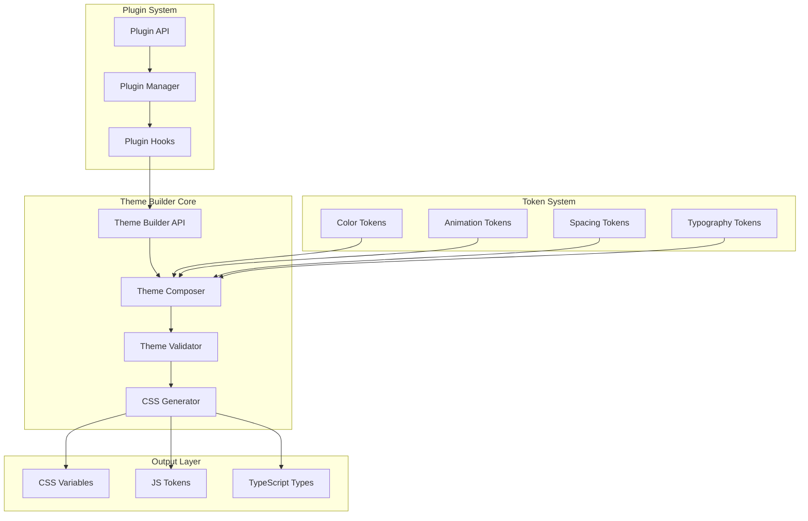

# Theming System: Medium-Term Implementation Plan (1-2 Months)

**Version:** 3.4.0 - 3.5.0  
**Timeline:** 4-8 weeks  
**Dependencies:** Short-term improvements (CSS variable generation, color scales, variant system)  

## 📋 Executive Summary

This document outlines the medium-term implementation plan for evolving our theming system into a composable, extensible, and performant architecture. Building upon the short-term improvements of CSS variable generation, color scales, and variant systems, we will implement a theme builder with composition, configurable animation tokens, and a plugin system for extensibility.

## 🏗️ System Architecture

### High-Level Architecture



### Component Architecture

```
src/
├── theme-builder/
│   ├── core/
│   │   ├── builder.ts              # Main theme builder class
│   │   ├── composer.ts             # Theme composition logic
│   │   ├── validator.ts            # Theme validation
│   │   └── generator.ts            # CSS/JS generation
│   ├── tokens/
│   │   ├── color.ts                # Color token system
│   │   ├── animation.ts            # Animation tokens
│   │   ├── spacing.ts              # Spacing tokens
│   │   ├── typography.ts           # Typography tokens
│   │   └── index.ts                # Token exports
│   ├── plugins/
│   │   ├── manager.ts              # Plugin management
│   │   ├── hooks.ts                # Plugin hook system
│   │   ├── api.ts                  # Plugin API surface
│   │   └── types.ts                # Plugin interfaces
│   └── index.ts                    # Public API
├── themes/
│   ├── presets/                    # Built-in theme presets
│   ├── compositions/               # Theme compositions
│   └── generated/                  # Generated theme files
└── components/
    └── [component-integration]     # Component theme integration
```

## 🎯 1. Theme Builder System with Composition

### 1.1 Core Theme Builder API

```typescript
// src/theme-builder/core/builder.ts
import { ThemeComposer } from './composer';
import { ThemeValidator } from './validator';
import { ThemeGenerator } from './generator';

export interface ThemeBuilderConfig {
  name: string;
  version: string;
  extends?: string | string[];
  tokens: ThemeTokenConfig;
  compositions?: ThemeComposition[];
  plugins?: ThemePlugin[];
  output?: OutputConfig;
}

export class ThemeBuilder {
  private composer: ThemeComposer;
  private validator: ThemeValidator;
  private generator: ThemeGenerator;
  private plugins: Map<string, ThemePlugin> = new Map();

  constructor(config: ThemeBuilderConfig) {
    this.composer = new ThemeComposer();
    this.validator = new ThemeValidator();
    this.generator = new ThemeGenerator();
    this.initialize(config);
  }

  // Fluent API for theme building
  extend(baseTheme: string | Theme): ThemeBuilder {
    this.composer.extend(baseTheme);
    return this;
  }

  compose(...themes: Theme[]): ThemeBuilder {
    this.composer.compose(themes);
    return this;
  }

  override(tokens: Partial<ThemeTokens>): ThemeBuilder {
    this.composer.override(tokens);
    return this;
  }

  variant(name: string, modifier: ThemeModifier): ThemeBuilder {
    this.composer.addVariant(name, modifier);
    return this;
  }

  plugin(plugin: ThemePlugin): ThemeBuilder {
    this.plugins.set(plugin.name, plugin);
    plugin.install(this);
    return this;
  }

  async build(): Promise<BuiltTheme> {
    // Apply plugin transformations
    for (const plugin of this.plugins.values()) {
      await plugin.transform?.(this.composer.getTheme());
    }

    // Validate theme
    const validation = await this.validator.validate(this.composer.getTheme());
    if (!validation.valid) {
      throw new ThemeValidationError(validation.errors);
    }

    // Generate outputs
    const outputs = await this.generator.generate(this.composer.getTheme());
    
    return {
      theme: this.composer.getTheme(),
      outputs,
      metadata: this.generateMetadata()
    };
  }
}
```

### 1.2 Theme Composition System

```typescript
// src/theme-builder/core/composer.ts
export interface ThemeComposition {
  name: string;
  layers: ThemeLayer[];
  mode: 'merge' | 'override' | 'blend';
}

export interface ThemeLayer {
  theme: Theme | string;
  weight?: number;
  filter?: (tokens: ThemeTokens) => Partial<ThemeTokens>;
}

export class ThemeComposer {
  private baseTheme?: Theme;
  private compositions: ThemeComposition[] = [];
  private overrides: Partial<ThemeTokens>[] = [];
  private variants: Map<string, ThemeVariant> = new Map();

  compose(themes: Theme[]): void {
    const composition: ThemeComposition = {
      name: 'custom-composition',
      layers: themes.map(theme => ({ theme })),
      mode: 'merge'
    };
    this.compositions.push(composition);
  }

  // Advanced composition with weighted blending
  blend(layers: ThemeLayer[]): void {
    const composition: ThemeComposition = {
      name: 'blended-composition',
      layers,
      mode: 'blend'
    };
    this.compositions.push(composition);
  }

  // Smart merging with conflict resolution
  private mergeThemes(themes: Theme[]): Theme {
    return themes.reduce((merged, theme) => {
      return this.deepMerge(merged, theme, {
        arrayMerge: this.arrayMergeStrategy,
        customMerge: this.customMergeStrategy
      });
    });
  }

  // Custom merge strategies for different token types
  private customMergeStrategy = (key: string) => {
    switch (key) {
      case 'colors':
        return this.colorMergeStrategy;
      case 'animations':
        return this.animationMergeStrategy;
      case 'spacing':
        return this.spacingMergeStrategy;
      default:
        return undefined;
    }
  };

  private colorMergeStrategy = (target: ColorTokens, source: ColorTokens) => {
    // Intelligent color merging with scale preservation
    const merged: ColorTokens = { ...target };
    
    for (const [key, value] of Object.entries(source)) {
      if (isColorScale(value)) {
        merged[key] = this.mergeColorScales(target[key], value);
      } else {
        merged[key] = value;
      }
    }
    
    return merged;
  };
}
```

### 1.3 Theme Validation System

```typescript
// src/theme-builder/core/validator.ts
export interface ValidationRule {
  name: string;
  test: (theme: Theme) => ValidationResult;
  severity: 'error' | 'warning' | 'info';
}

export class ThemeValidator {
  private rules: ValidationRule[] = [
    {
      name: 'color-contrast',
      test: this.validateColorContrast,
      severity: 'error'
    },
    {
      name: 'animation-performance',
      test: this.validateAnimationPerformance,
      severity: 'warning'
    },
    {
      name: 'token-completeness',
      test: this.validateTokenCompleteness,
      severity: 'error'
    }
  ];

  async validate(theme: Theme): Promise<ValidationReport> {
    const results = await Promise.all(
      this.rules.map(rule => rule.test(theme))
    );

    return {
      valid: !results.some(r => r.severity === 'error' && !r.passed),
      results,
      summary: this.generateSummary(results)
    };
  }

  private validateColorContrast(theme: Theme): ValidationResult {
    const issues: ValidationIssue[] = [];
    
    // Check WCAG AA compliance for all color combinations
    for (const [bg, fg] of this.getColorCombinations(theme)) {
      const contrast = this.calculateContrast(bg, fg);
      if (contrast < 4.5) {
        issues.push({
          path: `colors.${bg}/${fg}`,
          message: `Insufficient contrast ratio: ${contrast.toFixed(2)}`,
          expected: '≥ 4.5',
          actual: contrast.toFixed(2)
        });
      }
    }

    return {
      passed: issues.length === 0,
      issues,
      severity: 'error'
    };
  }
}
```

## 🎬 2. Animation Token System

### 2.1 Animation Token Architecture

```typescript
// src/theme-builder/tokens/animation.ts
export interface AnimationTokens {
  durations: {
    instant: string;      // 0ms
    fast: string;         // 150ms
    normal: string;       // 300ms
    slow: string;         // 500ms
    slower: string;       // 700ms
    slowest: string;      // 1000ms
    [key: string]: string;
  };
  
  easings: {
    linear: string;
    easeIn: string;
    easeOut: string;
    easeInOut: string;
    easeInQuad: string;
    easeOutQuad: string;
    easeInOutQuad: string;
    easeInCubic: string;
    easeOutCubic: string;
    easeInOutCubic: string;
    easeInQuart: string;
    easeOutQuart: string;
    easeInOutQuart: string;
    elastic: string;
    bounce: string;
    [key: string]: string;
  };
  
  keyframes: {
    [name: string]: KeyframeDefinition;
  };
  
  transitions: {
    [name: string]: TransitionDefinition;
  };
  
  animations: {
    [name: string]: AnimationDefinition;
  };
}

export interface KeyframeDefinition {
  from?: CSSProperties;
  to?: CSSProperties;
  steps?: { [percent: string]: CSSProperties };
}

export interface TransitionDefinition {
  property: string | string[];
  duration: string;
  easing: string;
  delay?: string;
}

export interface AnimationDefinition {
  keyframes: string | KeyframeDefinition;
  duration: string;
  easing: string;
  delay?: string;
  iterations?: number | 'infinite';
  direction?: 'normal' | 'reverse' | 'alternate' | 'alternate-reverse';
  fillMode?: 'none' | 'forwards' | 'backwards' | 'both';
  playState?: 'running' | 'paused';
}
```

### 2.2 Animation Builder API

```typescript
// src/theme-builder/tokens/animation-builder.ts
export class AnimationBuilder {
  private tokens: AnimationTokens = {
    durations: {},
    easings: {},
    keyframes: {},
    transitions: {},
    animations: {}
  };

  // Duration builder with validation
  duration(name: string, value: number | string): AnimationBuilder {
    const duration = typeof value === 'number' ? `${value}ms` : value;
    this.validateDuration(duration);
    this.tokens.durations[name] = duration;
    return this;
  }

  // Easing builder with cubic-bezier support
  easing(name: string, value: string | [number, number, number, number]): AnimationBuilder {
    const easing = Array.isArray(value) 
      ? `cubic-bezier(${value.join(', ')})` 
      : value;
    this.tokens.easings[name] = easing;
    return this;
  }

  // Keyframe builder with interpolation
  keyframe(name: string, definition: KeyframeDefinition): AnimationBuilder {
    this.tokens.keyframes[name] = this.processKeyframes(definition);
    return this;
  }

  // Transition builder with shorthand support
  transition(name: string, config: TransitionConfig): AnimationBuilder {
    const transition: TransitionDefinition = {
      property: config.property || 'all',
      duration: this.resolveDuration(config.duration),
      easing: this.resolveEasing(config.easing),
      delay: config.delay ? this.resolveDuration(config.delay) : undefined
    };
    this.tokens.transitions[name] = transition;
    return this;
  }

  // Animation builder with composition
  animation(name: string, config: AnimationConfig): AnimationBuilder {
    const animation: AnimationDefinition = {
      keyframes: config.keyframes,
      duration: this.resolveDuration(config.duration),
      easing: this.resolveEasing(config.easing),
      delay: config.delay ? this.resolveDuration(config.delay) : undefined,
      iterations: config.iterations,
      direction: config.direction,
      fillMode: config.fillMode,
      playState: config.playState
    };
    this.tokens.animations[name] = animation;
    return this;
  }

  // Preset animations
  usePreset(preset: AnimationPreset): AnimationBuilder {
    switch (preset) {
      case 'fade':
        this.createFadeAnimations();
        break;
      case 'slide':
        this.createSlideAnimations();
        break;
      case 'scale':
        this.createScaleAnimations();
        break;
      case 'rotate':
        this.createRotateAnimations();
        break;
    }
    return this;
  }

  private createFadeAnimations(): void {
    this.keyframe('fadeIn', {
      from: { opacity: 0 },
      to: { opacity: 1 }
    });
    
    this.keyframe('fadeOut', {
      from: { opacity: 1 },
      to: { opacity: 0 }
    });

    this.animation('fadeIn', {
      keyframes: 'fadeIn',
      duration: 'normal',
      easing: 'easeOut'
    });
  }
}
```

### 2.3 Animation System Integration

```typescript
// src/theme-builder/tokens/animation-system.ts
export class AnimationSystem {
  private motionPreference: 'no-preference' | 'reduce' = 'no-preference';
  private performanceMode: 'quality' | 'performance' = 'quality';

  // Adaptive animation system
  getAnimation(name: string, context?: AnimationContext): AnimationDefinition {
    const baseAnimation = this.animations[name];
    
    if (!baseAnimation) {
      throw new Error(`Animation "${name}" not found`);
    }

    // Apply motion preference
    if (this.motionPreference === 'reduce') {
      return this.reduceMotion(baseAnimation);
    }

    // Apply performance optimizations
    if (this.performanceMode === 'performance') {
      return this.optimizeAnimation(baseAnimation);
    }

    // Apply context-specific modifications
    if (context) {
      return this.applyContext(baseAnimation, context);
    }

    return baseAnimation;
  }

  private reduceMotion(animation: AnimationDefinition): AnimationDefinition {
    return {
      ...animation,
      duration: '0.01ms',
      iterations: 1
    };
  }

  private optimizeAnimation(animation: AnimationDefinition): AnimationDefinition {
    // Use GPU-accelerated properties only
    const optimized = { ...animation };
    
    if (optimized.keyframes && typeof optimized.keyframes !== 'string') {
      optimized.keyframes = this.optimizeKeyframes(optimized.keyframes);
    }

    return optimized;
  }

  private optimizeKeyframes(keyframes: KeyframeDefinition): KeyframeDefinition {
    const optimized: KeyframeDefinition = {};
    
    // Convert non-GPU properties to GPU-accelerated equivalents
    const gpuProperties = ['transform', 'opacity', 'filter'];
    
    for (const [step, props] of Object.entries(keyframes)) {
      optimized[step] = Object.entries(props).reduce((acc, [key, value]) => {
        if (gpuProperties.includes(key)) {
          acc[key] = value;
        } else {
          // Convert to GPU-accelerated equivalent if possible
          const converted = this.convertToGPU(key, value);
          if (converted) {
            Object.assign(acc, converted);
          }
        }
        return acc;
      }, {});
    }

    return optimized;
  }
}
```

## 🔌 3. Plugin System Architecture

### 3.1 Plugin API Design

```typescript
// src/theme-builder/plugins/types.ts
export interface ThemePlugin {
  name: string;
  version: string;
  description?: string;
  
  // Lifecycle hooks
  install?: (builder: ThemeBuilder) => void | Promise<void>;
  uninstall?: () => void | Promise<void>;
  
  // Theme transformation hooks
  transform?: (theme: Theme) => Theme | Promise<Theme>;
  beforeBuild?: (theme: Theme) => void | Promise<void>;
  afterBuild?: (result: BuiltTheme) => void | Promise<void>;
  
  // Token extension hooks
  extendTokens?: () => TokenExtensions;
  extendValidation?: () => ValidationRule[];
  
  // Component integration hooks
  componentHooks?: ComponentHooks;
}

export interface TokenExtensions {
  [tokenType: string]: {
    schema?: TokenSchema;
    builder?: TokenBuilder;
    generator?: TokenGenerator;
  };
}

export interface ComponentHooks {
  beforeRender?: (component: string, props: any) => any;
  afterRender?: (component: string, element: any) => void;
  styleInjection?: (component: string) => CSSProperties;
}
```

### 3.2 Plugin Manager Implementation

```typescript
// src/theme-builder/plugins/manager.ts
export class PluginManager {
  private plugins: Map<string, ThemePlugin> = new Map();
  private hooks: Map<string, Set<Function>> = new Map();
  private tokenExtensions: Map<string, TokenExtensions> = new Map();

  async register(plugin: ThemePlugin): Promise<void> {
    // Validate plugin
    this.validatePlugin(plugin);
    
    // Check dependencies
    await this.checkDependencies(plugin);
    
    // Register plugin
    this.plugins.set(plugin.name, plugin);
    
    // Install plugin
    if (plugin.install) {
      await plugin.install(this.builder);
    }
    
    // Register hooks
    this.registerHooks(plugin);
    
    // Register token extensions
    if (plugin.extendTokens) {
      this.tokenExtensions.set(plugin.name, plugin.extendTokens());
    }
  }

  async unregister(pluginName: string): Promise<void> {
    const plugin = this.plugins.get(pluginName);
    
    if (!plugin) {
      throw new Error(`Plugin "${pluginName}" not found`);
    }
    
    // Run uninstall hook
    if (plugin.uninstall) {
      await plugin.uninstall();
    }
    
    // Remove hooks
    this.removeHooks(plugin);
    
    // Remove token extensions
    this.tokenExtensions.delete(pluginName);
    
    // Remove plugin
    this.plugins.delete(pluginName);
  }

  // Execute hooks in order
  async executeHook(hookName: string, ...args: any[]): Promise<any> {
    const hooks = this.hooks.get(hookName);
    
    if (!hooks) {
      return;
    }
    
    let result = args[0];
    
    for (const hook of hooks) {
      result = await hook(result, ...args.slice(1));
    }
    
    return result;
  }

  // Get combined token extensions
  getTokenExtensions(): TokenExtensions {
    const combined: TokenExtensions = {};
    
    for (const extensions of this.tokenExtensions.values()) {
      Object.assign(combined, extensions);
    }
    
    return combined;
  }
}
```

### 3.3 Example Plugins

```typescript
// src/theme-builder/plugins/examples/a11y-plugin.ts
export const accessibilityPlugin: ThemePlugin = {
  name: 'accessibility',
  version: '1.0.0',
  description: 'Ensures theme meets WCAG accessibility standards',

  extendValidation() {
    return [
      {
        name: 'color-contrast-aaa',
        test: (theme) => this.validateContrastAAA(theme),
        severity: 'warning'
      },
      {
        name: 'focus-indicators',
        test: (theme) => this.validateFocusIndicators(theme),
        severity: 'error'
      }
    ];
  },

  transform(theme: Theme): Theme {
    return {
      ...theme,
      colors: this.enhanceColorContrast(theme.colors),
      focus: this.ensureFocusStyles(theme)
    };
  },

  componentHooks: {
    styleInjection(component: string): CSSProperties {
      // Inject focus styles for interactive components
      const interactiveComponents = ['Button', 'Input', 'Link', 'Tab'];
      
      if (interactiveComponents.includes(component)) {
        return {
          '&:focus-visible': {
            outline: '2px solid var(--focus-color)',
            outlineOffset: '2px'
          }
        };
      }
      
      return {};
    }
  }
};

// src/theme-builder/plugins/examples/motion-plugin.ts
export const motionPlugin: ThemePlugin = {
  name: 'motion',
  version: '1.0.0',
  description: 'Advanced motion and animation capabilities',

  install(builder: ThemeBuilder) {
    // Add motion-specific methods to builder
    builder.motion = new MotionAPI(builder);
  },

  extendTokens() {
    return {
      motion: {
        schema: motionTokenSchema,
        builder: MotionTokenBuilder,
        generator: MotionCSSGenerator
      }
    };
  },

  transform(theme: Theme): Theme {
    // Add motion tokens if not present
    if (!theme.motion) {
      theme.motion = defaultMotionTokens;
    }

    // Optimize animations for performance
    theme.animations = this.optimizeAnimations(theme.animations);

    return theme;
  },

  componentHooks: {
    beforeRender(component: string, props: any) {
      // Add motion props to components
      if (props.animate) {
        props['data-motion'] = props.animate;
        props.className = `${props.className || ''} motion-${props.animate}`;
      }
      return props;
    }
  }
};
```

## 🚀 4. Performance Optimizations

### 4.1 CSS Generation Optimization

```typescript
// src/theme-builder/core/generator.ts
export class ThemeGenerator {
  private cache: Map<string, GeneratedOutput> = new Map();
  private cssOptimizer: CSSOptimizer;

  async generate(theme: Theme, options?: GenerateOptions): Promise<GeneratedOutputs> {
    const cacheKey = this.getCacheKey(theme, options);
    
    // Check cache
    if (this.cache.has(cacheKey)) {
      return this.cache.get(cacheKey)!;
    }

    const outputs: GeneratedOutputs = {
      css: await this.generateCSS(theme, options),
      js: await this.generateJS(theme, options),
      types: await this.generateTypes(theme, options)
    };

    // Optimize outputs
    if (options?.optimize) {
      outputs.css = await this.cssOptimizer.optimize(outputs.css);
    }

    // Cache results
    this.cache.set(cacheKey, outputs);

    return outputs;
  }

  private async generateCSS(theme: Theme, options?: GenerateOptions): Promise<string> {
    const layers = [
      this.generateResetLayer(),
      this.generateBaseLayer(theme),
      this.generateComponentLayer(theme),
      this.generateUtilityLayer(theme)
    ];

    // Use CSS layers for better performance
    return `
      @layer reset, base, components, utilities;
      
      @layer reset {
        ${layers[0]}
      }
      
      @layer base {
        ${layers[1]}
      }
      
      @layer components {
        ${layers[2]}
      }
      
      @layer utilities {
        ${layers[3]}
      }
    `;
  }

  private generateBaseLayer(theme: Theme): string {
    // Generate CSS custom properties
    const cssVars = this.generateCSSVariables(theme);
    
    // Generate @property declarations for animations
    const propertyDeclarations = this.generatePropertyDeclarations(theme);
    
    return `
      :root {
        ${cssVars}
      }
      
      ${propertyDeclarations}
      
      @media (prefers-reduced-motion: reduce) {
        :root {
          --animation-duration-scale: 0.01;
        }
      }
    `;
  }
}
```

### 4.2 Runtime Performance

```typescript
// src/theme-builder/runtime/performance.ts
export class ThemePerformanceMonitor {
  private metrics: PerformanceMetrics = {
    renderTime: [],
    paintTime: [],
    animationFPS: [],
    memoryUsage: []
  };

  startMonitoring(): void {
    // Monitor render performance
    this.observeRenderPerformance();
    
    // Monitor animation performance
    this.observeAnimationPerformance();
    
    // Monitor memory usage
    this.observeMemoryUsage();
  }

  private observeRenderPerformance(): void {
    const observer = new PerformanceObserver((list) => {
      for (const entry of list.getEntries()) {
        if (entry.entryType === 'measure' && entry.name.startsWith('theme-')) {
          this.metrics.renderTime.push({
            timestamp: entry.startTime,
            duration: entry.duration,
            component: entry.name
          });
        }
      }
    });

    observer.observe({ entryTypes: ['measure'] });
  }

  private observeAnimationPerformance(): void {
    let lastTime = performance.now();
    let frames = 0;

    const measureFPS = () => {
      const currentTime = performance.now();
      frames++;

      if (currentTime >= lastTime + 1000) {
        const fps = Math.round((frames * 1000) / (currentTime - lastTime));
        this.metrics.animationFPS.push({
          timestamp: currentTime,
          fps,
          smooth: fps >= 55
        });

        frames = 0;
        lastTime = currentTime;
      }

      requestAnimationFrame(measureFPS);
    };

    requestAnimationFrame(measureFPS);
  }

  getReport(): PerformanceReport {
    return {
      averageRenderTime: this.calculateAverage(this.metrics.renderTime, 'duration'),
      averageFPS: this.calculateAverage(this.metrics.animationFPS, 'fps'),
      memoryTrend: this.analyzeMemoryTrend(),
      recommendations: this.generateRecommendations()
    };
  }
}
```

## 🧪 5. Testing Strategy

### 5.1 Theme Testing Framework

```typescript
// src/theme-builder/testing/framework.ts
export class ThemeTestFramework {
  private validator: ThemeValidator;
  private comparator: ThemeComparator;

  describe(suiteName: string, tests: () => void): void {
    // Test suite implementation
  }

  it(testName: string, test: ThemeTest): void {
    // Individual test implementation
  }

  // Theme-specific matchers
  expect(theme: Theme) {
    return {
      toHaveValidContrast(): void {
        const result = this.validator.validateColorContrast(theme);
        if (!result.passed) {
          throw new Error(`Theme has invalid contrast: ${result.issues}`);
        }
      },

      toMatchSnapshot(name?: string): void {
        const snapshot = this.generateSnapshot(theme);
        this.comparator.compareSnapshot(snapshot, name);
      },

      toBeAccessible(): void {
        const a11yResult = this.validator.validateAccessibility(theme);
        if (!a11yResult.passed) {
          throw new Error(`Theme has accessibility issues: ${a11yResult.issues}`);
        }
      },

      toPerformWell(): void {
        const perfResult = this.validator.validatePerformance(theme);
        if (!perfResult.passed) {
          throw new Error(`Theme has performance issues: ${perfResult.issues}`);
        }
      }
    };
  }
}

// Example test
describe('Futuristic Theme', () => {
  it('should have accessible color contrast', () => {
    const theme = new ThemeBuilder()
      .extend('base')
      .compose([futuristicTheme])
      .build();

    expect(theme).toHaveValidContrast();
    expect(theme).toBeAccessible();
  });

  it('should perform well with animations', () => {
    const theme = new ThemeBuilder()
      .extend('base')
      .plugin(motionPlugin)
      .animation('slideIn', { duration: 'fast', easing: 'easeOut' })
      .build();

    expect(theme).toPerformWell();
  });
});
```

### 5.2 Visual Regression Testing

```typescript
// src/theme-builder/testing/visual.ts
export class VisualRegressionTester {
  private browser: Browser;
  private page: Page;

  async captureThemeSnapshot(theme: Theme, components: string[]): Promise<ThemeSnapshot> {
    const snapshots: ComponentSnapshot[] = [];

    for (const component of components) {
      const snapshot = await this.captureComponent(component, theme);
      snapshots.push(snapshot);
    }

    return {
      theme: theme.name,
      timestamp: Date.now(),
      snapshots
    };
  }

  async compareThemes(themeA: Theme, themeB: Theme): Promise<ComparisonResult> {
    const snapshotA = await this.captureThemeSnapshot(themeA, ALL_COMPONENTS);
    const snapshotB = await this.captureThemeSnapshot(themeB, ALL_COMPONENTS);

    return this.compareSnapshots(snapshotA, snapshotB);
  }

  private async captureComponent(component: string, theme: Theme): Promise<ComponentSnapshot> {
    // Apply theme
    await this.page.evaluate((theme) => {
      window.applyTheme(theme);
    }, theme);

    // Render component
    await this.page.goto(`/components/${component}`);

    // Capture screenshots for different states
    const states = ['default', 'hover', 'focus', 'active', 'disabled'];
    const screenshots: Screenshot[] = [];

    for (const state of states) {
      await this.page.evaluate((state) => {
        document.querySelector('[data-testid="component"]').dataset.state = state;
      }, state);

      const screenshot = await this.page.screenshot({
        clip: await this.getComponentBounds()
      });

      screenshots.push({ state, data: screenshot });
    }

    return { component, screenshots };
  }
}
```

## 🔧 6. Developer Experience Improvements

### 6.1 CLI Tool

```typescript
// src/theme-builder/cli/index.ts
#!/usr/bin/env node

import { Command } from 'commander';
import { ThemeBuilder } from '../core/builder';
import { ThemeCLI } from './cli';

const program = new Command();
const cli = new ThemeCLI();

program
  .name('theme-builder')
  .description('Design System Theme Builder CLI')
  .version('1.0.0');

program
  .command('create <name>')
  .description('Create a new theme')
  .option('-e, --extends <base>', 'Base theme to extend')
  .option('-t, --template <template>', 'Use a template')
  .action(async (name, options) => {
    await cli.createTheme(name, options);
  });

program
  .command('build')
  .description('Build theme files')
  .option('-c, --config <file>', 'Configuration file', 'theme.config.js')
  .option('-o, --output <dir>', 'Output directory', './dist')
  .option('--watch', 'Watch for changes')
  .action(async (options) => {
    await cli.buildTheme(options);
  });

program
  .command('validate <theme>')
  .description('Validate a theme')
  .option('--fix', 'Attempt to fix issues')
  .action(async (theme, options) => {
    await cli.validateTheme(theme, options);
  });

program
  .command('preview <theme>')
  .description('Preview theme in browser')
  .option('-p, --port <port>', 'Port number', '3000')
  .action(async (theme, options) => {
    await cli.previewTheme(theme, options);
  });

program.parse();
```

### 6.2 VSCode Extension

```typescript
// src/theme-builder/vscode/extension.ts
export function activate(context: vscode.ExtensionContext) {
  // Theme preview panel
  const previewProvider = new ThemePreviewProvider(context);
  
  // IntelliSense for theme tokens
  const completionProvider = vscode.languages.registerCompletionItemProvider(
    ['typescript', 'javascript', 'css'],
    new ThemeTokenCompletionProvider(),
    '.'
  );

  // Color decorators
  const colorDecorator = new ThemeColorDecorator();
  
  // Commands
  const commands = [
    vscode.commands.registerCommand('theme-builder.preview', () => {
      previewProvider.showPreview();
    }),
    
    vscode.commands.registerCommand('theme-builder.generateTypes', () => {
      generateThemeTypes();
    }),
    
    vscode.commands.registerCommand('theme-builder.validate', () => {
      validateCurrentTheme();
    })
  ];

  context.subscriptions.push(
    completionProvider,
    ...commands
  );
}

class ThemeTokenCompletionProvider implements vscode.CompletionItemProvider {
  async provideCompletionItems(
    document: vscode.TextDocument,
    position: vscode.Position
  ): Promise<vscode.CompletionItem[]> {
    const linePrefix = document.lineAt(position).text.substr(0, position.character);
    
    if (linePrefix.endsWith('theme.')) {
      return this.getThemeCompletions();
    }
    
    if (linePrefix.includes('var(--')) {
      return this.getCSSVariableCompletions();
    }
    
    return [];
  }
}
```

## 📊 7. Integration with Component Library

### 7.1 Component Theme Integration

```typescript
// src/components/theme-integration/index.ts
export interface ThemedComponent<P = {}> {
  displayName: string;
  themeKey: string;
  defaultTheme: ComponentTheme;
  variants?: Record<string, ComponentVariant>;
}

export function createThemedComponent<P extends object>(
  Component: React.ComponentType<P>,
  config: ThemedComponentConfig
): ThemedComponent<P> {
  const ThemedComponent = forwardRef<any, P & ThemeProps>((props, ref) => {
    const { theme: themeProp, variant, ...restProps } = props;
    const theme = useTheme();
    const componentTheme = useComponentTheme(config.themeKey, themeProp);
    
    return (
      <ThemeProvider theme={componentTheme}>
        <Component
          ref={ref}
          {...restProps}
          className={cn(
            componentTheme.className,
            variant && componentTheme.variants?.[variant],
            props.className
          )}
        />
      </ThemeProvider>
    );
  });

  ThemedComponent.displayName = `Themed${Component.displayName || Component.name}`;
  ThemedComponent.themeKey = config.themeKey;
  ThemedComponent.defaultTheme = config.defaultTheme;

  return ThemedComponent as any;
}

// Example usage
export const ThemedButton = createThemedComponent(Button, {
  themeKey: 'button',
  defaultTheme: {
    className: 'btn',
    variants: {
      primary: 'btn-primary',
      secondary: 'btn-secondary',
      ghost: 'btn-ghost'
    }
  }
});
```

### 7.2 Theme Context System

```typescript
// src/components/theme-integration/context.ts
export const ThemeContext = createContext<ThemeContextValue>({
  theme: defaultTheme,
  setTheme: () => {},
  mode: 'light',
  setMode: () => {}
});

export function ThemeProvider({ children, theme, config }: ThemeProviderProps) {
  const [currentTheme, setCurrentTheme] = useState(theme);
  const [mode, setMode] = useState<ThemeMode>('light');
  
  // Apply theme to DOM
  useEffect(() => {
    const cssVars = generateCSSVariables(currentTheme);
    applyThemeToDOM(cssVars);
    
    // Apply component styles
    if (config?.injectStyles) {
      injectComponentStyles(currentTheme);
    }
  }, [currentTheme, config]);

  // Handle system preference changes
  useEffect(() => {
    const mediaQuery = window.matchMedia('(prefers-color-scheme: dark)');
    
    const handleChange = (e: MediaQueryListEvent) => {
      if (config?.respectSystemPreference) {
        setMode(e.matches ? 'dark' : 'light');
      }
    };

    mediaQuery.addEventListener('change', handleChange);
    return () => mediaQuery.removeEventListener('change', handleChange);
  }, [config]);

  const value = useMemo(() => ({
    theme: currentTheme,
    setTheme: setCurrentTheme,
    mode,
    setMode,
    config
  }), [currentTheme, mode, config]);

  return (
    <ThemeContext.Provider value={value}>
      {children}
    </ThemeContext.Provider>
  );
}
```

## 📅 8. Implementation Timeline & Milestones

### Phase 1: Foundation (Weeks 1-2)

**Goal:** Establish core theme builder architecture

- [ ] **Week 1**
  - Implement ThemeBuilder core class
  - Create ThemeComposer with basic composition
  - Set up project structure and build pipeline
  - Write unit tests for core functionality

- [ ] **Week 2**
  - Implement ThemeValidator with basic rules
  - Create ThemeGenerator for CSS output
  - Add TypeScript type generation
  - Integration tests for builder pipeline

**Deliverables:**
- Working theme builder with composition
- Basic validation system
- CSS variable generation

### Phase 2: Animation System (Weeks 3-4)

**Goal:** Implement comprehensive animation token system

- [ ] **Week 3**
  - Design and implement AnimationTokens interface
  - Create AnimationBuilder API
  - Implement animation optimization system
  - Add motion preference support

- [ ] **Week 4**
  - Build preset animation library
  - Create animation testing utilities
  - Performance monitoring for animations
  - Documentation and examples

**Deliverables:**
- Complete animation token system
- Animation builder with presets
- Performance-optimized animations

### Phase 3: Plugin Architecture (Weeks 5-6)

**Goal:** Create extensible plugin system

- [ ] **Week 5**
  - Implement PluginManager
  - Design plugin API and hooks
  - Create example plugins (a11y, motion)
  - Plugin validation and security

- [ ] **Week 6**
  - Component integration hooks
  - Plugin marketplace structure
  - Plugin testing framework
  - Documentation and plugin guide

**Deliverables:**
- Working plugin system
- 3-5 example plugins
- Plugin development guide

### Phase 4: Integration & Polish (Weeks 7-8)

**Goal:** Complete integration with component library

- [ ] **Week 7**
  - Component theme integration
  - Theme context system
  - Developer tools (CLI, VSCode)
  - Performance optimization

- [ ] **Week 8**
  - Comprehensive testing
  - Documentation completion
  - Migration guide from v3.3
  - Performance benchmarking

**Deliverables:**
- Fully integrated theme system
- Complete documentation
- Migration tools and guides

## 🎯 Success Metrics

### Technical Metrics
- **Build Performance:** < 500ms for full theme build
- **Runtime Performance:** < 16ms paint time for theme switches
- **Bundle Size:** < 15KB gzipped for core system
- **Type Safety:** 100% TypeScript coverage

### Quality Metrics
- **Test Coverage:** > 90% for core systems
- **Accessibility:** WCAG AA compliance for all generated themes
- **Browser Support:** All modern browsers + IE11 with graceful degradation
- **Plugin Ecosystem:** 10+ community plugins within 3 months

### Developer Experience Metrics
- **Time to First Theme:** < 5 minutes from installation
- **Documentation Coverage:** 100% API documentation
- **CLI Usage:** 80% of developers using CLI tools
- **Community Adoption:** 50+ projects using the system

## 🚀 Next Steps

After completing the medium-term plan:

1. **Long-term Vision (3-6 months)**
   - AI-powered theme generation
   - Cross-platform theme export (iOS, Android, Figma)
   - Real-time collaborative theme editing
   - Advanced animation choreography system

2. **Community Building**
   - Open-source plugin marketplace
   - Theme sharing platform
   - Regular theme design competitions
   - Educational content and workshops

3. **Enterprise Features**
   - Multi-brand theme management
   - A/B testing integration
   - Analytics and usage tracking
   - White-label customization

---

This medium-term plan builds upon the short-term improvements to create a world-class theming system that is powerful, extensible, and delightful to use. The focus on composition, animation tokens, and plugins ensures that the system can grow with the needs of the design system and its users.