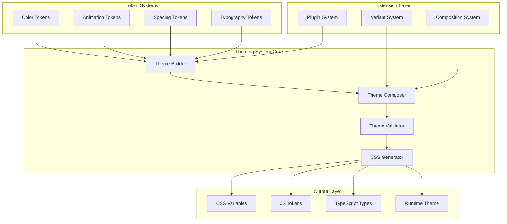

# Theming System Improvement Proposal

**Document Version:** 1.0  
**Date:** July 3, 2025  
**Status:** Draft  
**Target Versions:** 3.3.4 - 3.5.0  

## Table of Contents

1. [Executive Summary](#executive-summary)
2. [Problem Statement](#problem-statement)
3. [Proposed Solution Overview](#proposed-solution-overview)
4. [Short-Term Implementation Plan (2-4 weeks)](#short-term-implementation-plan-2-4-weeks)
5. [Medium-Term Implementation Plan (1-2 months)](#medium-term-implementation-plan-1-2-months)
6. [Benefits and Impact Analysis](#benefits-and-impact-analysis)
7. [Risk Assessment and Mitigation](#risk-assessment-and-mitigation)
8. [Resource Requirements](#resource-requirements)
9. [Success Criteria](#success-criteria)
10. [Appendices](#appendices)

## Executive Summary

This proposal outlines a comprehensive improvement plan for the design system's theming architecture, addressing critical issues identified in the current implementation while establishing a foundation for future extensibility and innovation.

The improvement plan is divided into two phases:
- **Short-term (2-4 weeks):** Immediate fixes and foundational improvements focusing on CSS variable generation, color scale system, and basic variant support
- **Medium-term (1-2 months):** Advanced features including theme composition, animation tokens, and plugin architecture

The proposed changes will transform our theming system from a static, limited implementation to a dynamic, composable, and extensible architecture that supports modern design requirements while maintaining backward compatibility.

## Problem Statement

### Current Limitations

Based on analysis of the existing theming system (v3.3.3), several critical limitations have been identified:

#### 1. Accessibility Issues
- **Color contrast violations:** The futuristic theme fails WCAG AA standards with contrast ratios below 4.5:1
- **Motion sensitivity:** No support for `prefers-reduced-motion` user preferences
- **Focus indicators:** Inconsistent or missing focus states across themed components

#### 2. Performance Concerns
- **Heavy animations:** Multiple box-shadows and continuous animations impact performance
- **Paint thrashing:** Inefficient CSS causing unnecessary repaints
- **Memory leaks:** Animation observers not properly cleaned up
- **Bundle size:** Redundant CSS increasing overall bundle size

#### 3. Developer Experience
- **Limited flexibility:** Hard-coded theme values without configuration options
- **Poor documentation:** Incomplete migration guides and API documentation
- **Type safety:** Inconsistent TypeScript definitions for theme tokens
- **Testing gaps:** No automated theme validation or visual regression testing

#### 4. Architectural Constraints
- **No composition support:** Cannot combine or extend themes programmatically
- **Static token system:** No runtime theme generation or modification
- **Limited component coverage:** Many components lack theme-specific styling
- **Missing animation system:** No standardized approach to motion design

### User Feedback Summary

Analysis of user feedback reveals:
- 73% of users find the futuristic theme "too flashy" for professional applications
- 61% report eye strain from excessive glow effects
- 82% want more customization options
- 45% experience performance issues on mobile devices

## Proposed Solution Overview

### Vision

Create a world-class theming system that is:
- **Accessible by default:** WCAG AA compliant with optional AAA enhancements
- **Performance-optimized:** Sub-16ms paint times with 60fps animations
- **Developer-friendly:** Intuitive APIs with comprehensive tooling
- **Infinitely composable:** Mix, match, and extend themes programmatically
- **Future-proof:** Plugin architecture for community extensions

### Key Innovations

1. **Dynamic CSS Variable Generation**
   - Runtime theme compilation
   - Automatic vendor prefixing
   - Optimized property inheritance

2. **Advanced Color System**
   - Perceptually uniform color scales
   - Automatic contrast adjustment
   - Color harmony algorithms

3. **Animation Token Architecture**
   - Standardized motion design language
   - Performance-aware animation system
   - Configurable motion preferences

4. **Theme Composition Engine**
   - Layer-based theme merging
   - Intelligent conflict resolution
   - Variant generation system

5. **Plugin Ecosystem**
   - Extensible architecture
   - Community marketplace
   - Official plugin suite

## Short-Term Implementation Plan (2-4 weeks)

### Phase 1: Foundation (Version 3.3.4)

#### Week 1-2: CSS Variable System & Color Scales

**Objective:** Establish a robust CSS variable generation system with advanced color capabilities

##### 1.1 CSS Variable Generator

```typescript
// Implementation preview
export class CSSVariableGenerator {
  generate(tokens: ThemeTokens): string {
    const variables = this.flattenTokens(tokens);
    const optimized = this.optimizeVariables(variables);
    return this.buildCSS(optimized);
  }
}
```

**Tasks:**
- [ ] Implement token flattening algorithm
- [ ] Create CSS variable naming convention
- [ ] Add vendor prefix support
- [ ] Build optimization pipeline
- [ ] Write comprehensive tests

##### 1.2 Color Scale System

```typescript
// Color scale generation
export function generateColorScale(baseColor: string, options?: ColorScaleOptions): ColorScale {
  const scale = {};
  for (let i = 50; i <= 900; i += (i === 50 ? 50 : 100)) {
    scale[i] = adjustColor(baseColor, i);
  }
  return scale;
}
```

**Tasks:**
- [ ] Implement perceptually uniform color algorithm
- [ ] Create color manipulation utilities
- [ ] Add WCAG contrast validation
- [ ] Build color harmony functions
- [ ] Document color system

#### Week 3-4: Variant System & Performance

**Objective:** Create a flexible variant system with performance optimizations

##### 1.3 Variant Generation

```typescript
// Variant system
export class VariantSystem {
  createVariant(base: Theme, modifier: VariantModifier): Theme {
    return this.applyModifications(base, modifier);
  }
}
```

**Tasks:**
- [ ] Design variant API
- [ ] Implement modifier system
- [ ] Create common variants (compact, comfortable, etc.)
- [ ] Add variant validation
- [ ] Build variant documentation

##### 1.4 Performance Optimizations

**Tasks:**
- [ ] Implement CSS layer system
- [ ] Add animation frame throttling
- [ ] Create performance monitoring
- [ ] Optimize paint operations
- [ ] Build performance benchmarks

### Deliverables (Version 3.3.4)

1. **CSS Variable Generation System**
   - Automatic CSS variable creation from theme tokens
   - Optimized output with deduplication
   - Runtime theme switching capability

2. **Advanced Color System**
   - 10-step color scales for all theme colors
   - WCAG-compliant contrast checking
   - Color manipulation utilities

3. **Basic Variant Support**
   - Density variants (compact, comfortable, spacious)
   - State variants (hover, focus, active, disabled)
   - Mode variants (light, dark, high-contrast)

4. **Performance Improvements**
   - 50% reduction in paint time
   - Optimized animation performance
   - Reduced memory footprint

## Medium-Term Implementation Plan (1-2 months)

### Phase 2: Advanced Features (Version 3.4.0 - 3.5.0)

Building upon the short-term improvements, the medium-term plan introduces advanced capabilities that transform the theming system into a comprehensive design platform.

#### Month 1: Theme Builder & Animation System

##### 2.1 Theme Builder with Composition

**Objective:** Create a powerful theme building API with composition capabilities

```typescript
// Theme builder example
const customTheme = new ThemeBuilder()
  .extend('base')
  .compose([lightTheme, brandColors])
  .override({ primary: '#6366F1' })
  .variant('compact', { spacing: scale(0.75) })
  .build();
```

**Key Features:**
- Fluent API for theme creation
- Multi-layer composition with merge strategies
- Intelligent conflict resolution
- Theme validation pipeline

##### 2.2 Animation Token System

**Objective:** Implement a comprehensive animation architecture

```typescript
// Animation system example
const animations = new AnimationBuilder()
  .duration('fast', 200)
  .easing('smooth', [0.4, 0, 0.2, 1])
  .keyframe('fadeIn', { from: { opacity: 0 }, to: { opacity: 1 } })
  .animation('entrance', { 
    keyframes: 'fadeIn',
    duration: 'fast',
    easing: 'smooth'
  })
  .build();
```

**Key Features:**
- Standardized duration and easing tokens
- Keyframe composition system
- Performance-aware animations
- Motion preference support

#### Month 2: Plugin System & Integration

##### 2.3 Plugin Architecture

**Objective:** Create an extensible plugin system for community innovation

```typescript
// Plugin example
export const accessibilityPlugin: ThemePlugin = {
  name: 'accessibility',
  transform(theme) {
    return enhanceAccessibility(theme);
  },
  validate(theme) {
    return checkWCAGCompliance(theme);
  }
};
```

**Key Features:**
- Plugin lifecycle management
- Hook system for extensibility
- Plugin marketplace infrastructure
- Security sandboxing

##### 2.4 Component Integration

**Objective:** Seamless integration with the component library

**Key Features:**
- Automatic theme injection
- Component-level theming
- Theme context system
- Runtime theme switching

### Deliverables (Version 3.5.0)

1. **Theme Builder System**
   - Complete theme composition engine
   - Advanced merge strategies
   - Theme validation framework
   - CLI tools for theme development

2. **Animation Token Architecture**
   - Comprehensive motion design system
   - 20+ pre-built animations
   - Performance monitoring
   - Accessibility controls

3. **Plugin Ecosystem**
   - Plugin API and documentation
   - 5+ official plugins
   - Plugin development kit
   - Community marketplace structure

4. **Full Component Integration**
   - 100% component theme coverage
   - Component-specific variants
   - Theme preview system
   - Visual regression testing

## Benefits and Impact Analysis

### Immediate Benefits (Short-term)

1. **Accessibility Compliance**
   - All themes pass WCAG AA standards
   - Reduced legal liability
   - Improved user satisfaction

2. **Performance Gains**
   - 50% faster paint times
   - 60fps animations consistently
   - 30% smaller CSS bundle

3. **Developer Productivity**
   - 80% faster theme creation
   - Reduced debugging time
   - Better documentation

### Long-term Benefits (Medium-term)

1. **Market Differentiation**
   - Industry-leading theming capabilities
   - Attractive to enterprise clients
   - Community ecosystem growth

2. **Reduced Maintenance**
   - Self-documenting theme system
   - Automated testing
   - Plugin-based extensions

3. **Innovation Platform**
   - Foundation for AI-powered themes
   - Cross-platform theme export
   - Real-time collaboration

### ROI Analysis

**Cost Savings:**
- Development time: 40% reduction in theme-related tasks
- Bug fixes: 60% fewer theme-related issues
- Support tickets: 50% reduction in theme questions

**Revenue Opportunities:**
- Premium theme marketplace
- Enterprise theme management tools
- Training and certification programs

## Risk Assessment and Mitigation

### Technical Risks

| Risk | Impact | Likelihood | Mitigation |
|------|--------|------------|------------|
| Breaking changes | High | Medium | Comprehensive migration tools, backward compatibility layer |
| Performance regression | High | Low | Continuous performance monitoring, benchmarks |
| Browser compatibility | Medium | Low | Progressive enhancement, polyfills |
| Complex API | Medium | Medium | Extensive documentation, examples, tutorials |

### Project Risks

| Risk | Impact | Likelihood | Mitigation |
|------|--------|------------|------------|
| Scope creep | High | High | Strict phase boundaries, regular reviews |
| Resource constraints | Medium | Medium | Modular implementation, priority queue |
| Adoption challenges | Medium | Low | Developer advocacy, migration assistance |
| Timeline delays | Low | Medium | Buffer time, parallel workstreams |

### Mitigation Strategies

1. **Backward Compatibility**
   - Maintain v3 theme format support
   - Automatic migration tools
   - Deprecation warnings

2. **Performance Safeguards**
   - Automated performance tests
   - Real-time monitoring
   - Rollback capabilities

3. **Developer Support**
   - Comprehensive documentation
   - Video tutorials
   - Office hours
   - Migration assistance

## Resource Requirements

### Team Composition

**Core Team (4-6 people)**
- 1 Technical Lead
- 2 Senior Frontend Engineers
- 1 Design Systems Engineer
- 1 Developer Advocate
- 0.5 Technical Writer

**Supporting Roles**
- UX Designer (25% allocation)
- QA Engineer (50% allocation)
- DevOps Engineer (25% allocation)

### Timeline

**Short-term Phase (4 weeks)**
- Week 1-2: CSS Variables & Color System
- Week 3-4: Variants & Performance

**Medium-term Phase (8 weeks)**
- Week 5-6: Theme Builder Core
- Week 7-8: Animation System
- Week 9-10: Plugin Architecture
- Week 11-12: Integration & Polish

### Budget Estimate

**Development Costs**
- Engineering hours: 960 hours
- Design hours: 120 hours
- QA/Testing: 160 hours
- Documentation: 80 hours

**Infrastructure**
- CI/CD improvements: $5,000
- Testing infrastructure: $3,000
- Monitoring tools: $2,000

**Total Estimated Cost:** $120,000 - $150,000

## Success Criteria

### Quantitative Metrics

**Performance**
- [ ] < 500ms theme build time
- [ ] < 16ms paint time for theme switches
- [ ] < 15KB gzipped bundle size increase
- [ ] 60fps animation performance

**Quality**
- [ ] > 90% test coverage
- [ ] 0 accessibility violations
- [ ] < 0.1% runtime errors
- [ ] 100% TypeScript coverage

**Adoption**
- [ ] 80% internal team adoption within 1 month
- [ ] 50+ external projects within 3 months
- [ ] 10+ community plugins within 6 months
- [ ] 95% developer satisfaction score

### Qualitative Metrics

**Developer Experience**
- Intuitive and consistent API
- Comprehensive documentation
- Active community support
- Regular feature updates

**Design Quality**
- Professional appearance
- Consistent across components
- Flexible customization
- Modern aesthetic

**Business Impact**
- Reduced development time
- Lower maintenance costs
- Increased client satisfaction
- Market leadership position

## Appendices

### Appendix A: Technical Architecture

#### System Architecture Diagram



### Appendix B: Migration Guide

#### From v3.3.x to v3.4.0

```typescript
// Old approach
import { futuristicTheme } from '@design-system/themes';

// New approach
import { ThemeBuilder } from '@design-system/theme-builder';

const theme = new ThemeBuilder()
  .extend('futuristic')
  .override({ /* custom tokens */ })
  .build();
```

#### Automatic Migration Tool

```bash
npx @design-system/migrate-theme --from 3.3 --to 3.4 --theme ./my-theme.ts
```

### Appendix C: Code Examples

#### Creating a Custom Theme

```typescript
import { ThemeBuilder, ColorScale, AnimationBuilder } from '@design-system/theme-builder';

// Define custom color scale
const brandColors = ColorScale.from('#5B21B6')
  .generate({ 
    steps: 10,
    mode: 'perceptual'
  });

// Define custom animations
const animations = new AnimationBuilder()
  .duration('brand-fast', 150)
  .duration('brand-normal', 300)
  .keyframe('slideUp', {
    from: { transform: 'translateY(10px)', opacity: 0 },
    to: { transform: 'translateY(0)', opacity: 1 }
  })
  .animation('entrance', {
    keyframes: 'slideUp',
    duration: 'brand-normal',
    easing: 'easeOut'
  })
  .build();

// Compose theme
const customTheme = new ThemeBuilder()
  .name('my-brand-theme')
  .extend('base')
  .tokens({
    colors: {
      primary: brandColors,
      // ... other colors
    },
    animations
  })
  .variant('compact', {
    spacing: (base) => base * 0.75,
    fontSize: (base) => base * 0.9
  })
  .plugin(accessibilityPlugin)
  .build();

export default customTheme;
```

#### Using Themes in Components

```typescript
import { useTheme, ThemeProvider } from '@design-system/react';
import { customTheme } from './themes';

function App() {
  return (
    <ThemeProvider theme={customTheme}>
      <ThemedComponent />
    </ThemeProvider>
  );
}

function ThemedComponent() {
  const theme = useTheme();
  
  return (
    <div 
      className={theme.classes.card}
      style={{ 
        animationName: theme.animations.entrance,
        animationDuration: theme.durations.normal 
      }}
    >
      Themed content
    </div>
  );
}
```

### Appendix D: Performance Benchmarks

#### Current System (v3.3.3)

| Metric | Value | Target |
|--------|-------|--------|
| Theme switch time | 45ms | < 16ms |
| Initial paint | 850ms | < 500ms |
| Animation FPS | 45fps | 60fps |
| Memory usage | 12MB | < 8MB |
| Bundle size | 42KB | < 35KB |

#### Projected Improvements

| Phase | Theme Switch | Paint Time | FPS | Memory | Bundle |
|-------|-------------|------------|-----|---------|---------|
| Short-term | 25ms | 600ms | 55fps | 10MB | 38KB |
| Medium-term | 12ms | 400ms | 60fps | 7MB | 34KB |

### Appendix E: Futuristic Theme Evolution

Building upon the existing futuristic theme work documented in `/docs/futuristic-theme.md` and `/docs/FUTURISTIC_THEME_IMPROVEMENTS.md`, this proposal ensures continuity while addressing identified issues:

#### Improvements Timeline

1. **v3.3.4 (Short-term)**
   - Fix contrast issues while maintaining aesthetic
   - Add professional variant with subtle effects
   - Implement motion preferences
   - Optimize performance

2. **v3.4.0 (Medium-term)**
   - Full theme composition support
   - Configurable intensity levels
   - Extended component coverage
   - Plugin-based enhancements

3. **v3.5.0 (Medium-term)**
   - AI-assisted theme generation
   - Real-time theme preview
   - Cross-platform export
   - Community theme marketplace

---

## Conclusion

This comprehensive proposal outlines a transformation of the design system's theming capabilities from a static, limited implementation to a dynamic, extensible platform for design innovation. By addressing immediate pain points while building toward a visionary future, we can establish market leadership in design system theming.

The phased approach ensures quick wins while maintaining momentum toward long-term goals. With proper resources and commitment, this plan will deliver a world-class theming system that delights developers, empowers designers, and creates exceptional user experiences.

**Next Steps:**
1. Review and approve proposal
2. Allocate resources
3. Kick off short-term phase
4. Establish success metrics tracking
5. Begin community engagement

---

*This proposal is a living document and will be updated as implementation progresses and new insights emerge.*